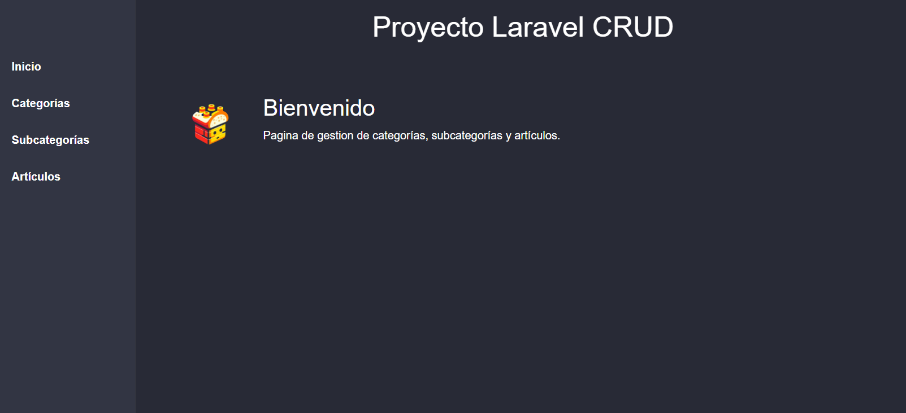
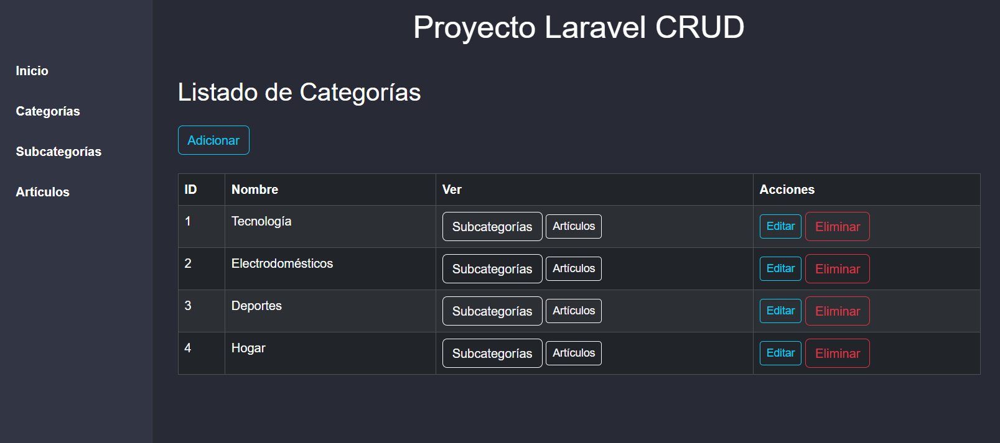

<p align="center">
    
</p>

<h1 align="center">🚀 Proyecto Laravel CRUD</h1>

<p align="center">
    Sistema CRUD completo de Categorías, Subcategorías y Artículos <br>
    desarrollado con Laravel 9 y Bootstrap 5.
</p>

<p align="center">
    
    
    
    
</p>

---

## 📚 Descripción

Este proyecto es un sistema CRUD construido con Laravel 9, que permite la **gestión de Categorías, Subcategorías y Artículos** de forma sencilla y eficiente. Ideal como base para proyectos de inventario, catálogo o administración de contenidos.

## 🧩 Funcionalidades

- ✅ Registro, edición y eliminación de categorías
- ✅ Módulo reutilizable de subcategorías (desde navbar y desde categoría)
- ✅ Módulo reutilizable de artículos (desde navbar, categoría o subcategoría)
- ✅ Interfaz limpia y responsive con Bootstrap 5
- ✅ Sidebar fija + diseño tipo dashboard
- ✅ Validaciones de formularios con mensajes amigables

## 🛠️ Tecnologías

- Laravel 9.19
- PHP 8.x
- MySQL / MariaDB
- Bootstrap 5.3
- Blade Templates

---

## 🚀 Instalación

1. Clona este repositorio:

```bash
git clone https://github.com/tu-usuario/tu-repositorio.git
cd tu-repositorio





Estructura Proyecto 
├── app/
├── database/
│   └── migrations/
├── resources/
│   └── views/
│       ├── categoria/
│       ├── subcategoria/
│       ├── articulo/
│       └── layouts/
├── routes/
│   └── web.php
└── public/


🧑‍💻 Autor
Joel Flores
📍 Bolivia
🎸 Desarrollador Full Stack en formación
GitHub | LinkedIn

